# Keycloak Integration Guide for PKI Manager

This guide provides step-by-step instructions for configuring Keycloak as the OIDC provider for PKI Manager.

## Table of Contents

- [Overview](#overview)
- [Prerequisites](#prerequisites)
- [Keycloak Configuration](#keycloak-configuration)
  - [Step 1: Access Keycloak Admin Console](#step-1-access-keycloak-admin-console)
  - [Step 2: Create or Select a Realm](#step-2-create-or-select-a-realm)
  - [Step 3: Create the SPA Client (pki-web)](#step-3-create-the-spa-client-pki-web)
  - [Step 4: Create a Test User](#step-4-create-a-test-user)
  - [Step 5: (Optional) Create M2M Client (pki-service)](#step-5-optional-create-m2m-client-pki-service)
- [PKI Manager Configuration](#pki-manager-configuration)
  - [Backend Configuration](#backend-configuration)
  - [Frontend Configuration](#frontend-configuration)
  - [Docker Configuration](#docker-configuration)
- [Testing the Integration](#testing-the-integration)
- [Troubleshooting](#troubleshooting)
- [E2E Testing Configuration](#e2e-testing-configuration)

## Overview

PKI Manager uses OpenID Connect (OIDC) for authentication. Keycloak serves as the identity provider, handling:

- User authentication via Authorization Code Flow with PKCE
- Token issuance (access tokens, refresh tokens, ID tokens)
- User session management
- Optional: Machine-to-machine (M2M) authentication via Client Credentials flow

## Prerequisites

- Keycloak server (version 20+) accessible via HTTPS
- Admin access to Keycloak
- PKI Manager deployed and accessible

## Keycloak Configuration

### Step 1: Access Keycloak Admin Console

1. Navigate to your Keycloak admin URL (e.g., `https://your-keycloak-domain/admin`)
2. Log in with administrator credentials

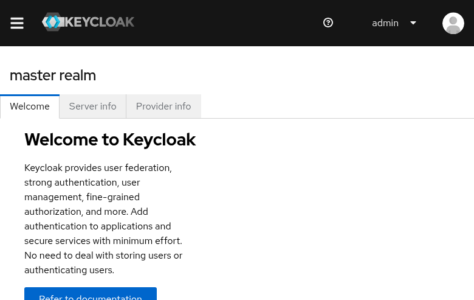

### Step 2: Create or Select a Realm

Realms isolate users and applications. For PKI Manager, create a dedicated realm or use an existing one.

1. Click the realm dropdown in the top-left sidebar
2. Click **Create realm** or select an existing realm (e.g., `pki-manager`)

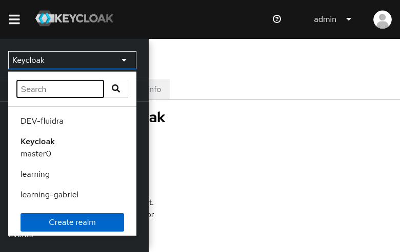

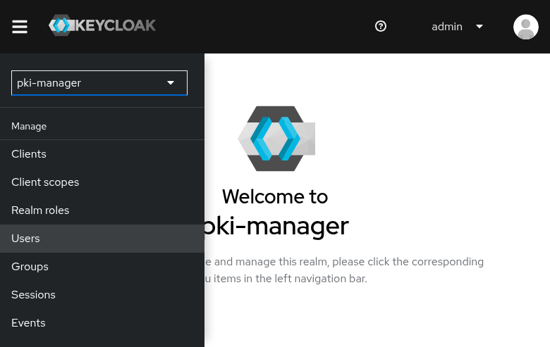

### Step 3: Create the SPA Client (pki-web)

The `pki-web` client is a **public client** for the frontend SPA application using PKCE.

#### 3.1 Navigate to Clients

1. In the sidebar, click **Clients**
2. Click **Create client**

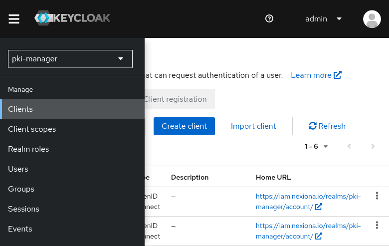

#### 3.2 General Settings (Step 1)

Configure the basic client information:

| Field | Value |
|-------|-------|
| Client type | OpenID Connect |
| Client ID | `pki-web` |
| Name | PKI Manager Web |
| Description | Public SPA client for PKI Manager frontend with PKCE |

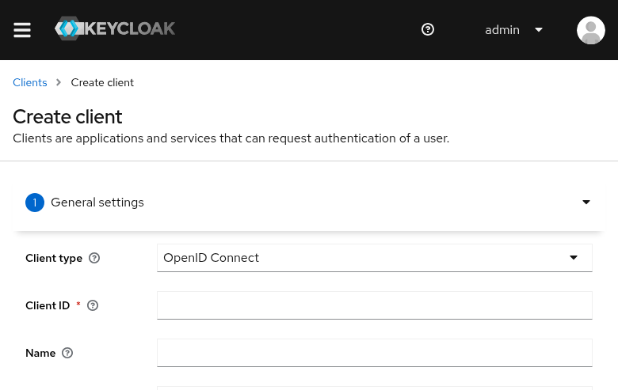
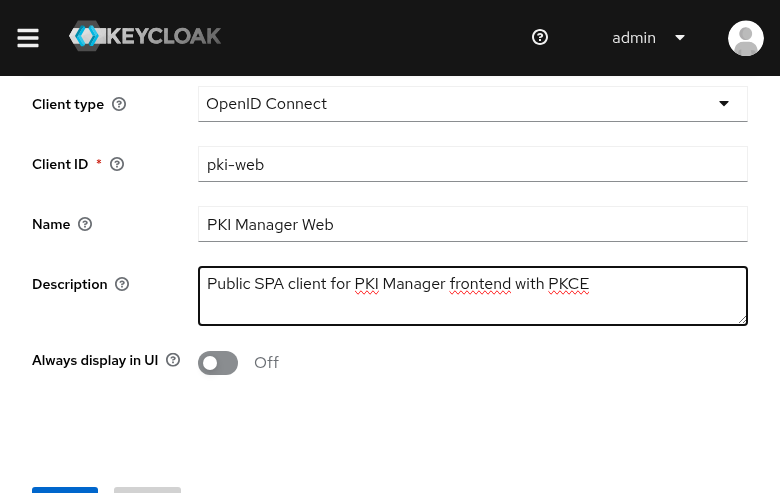

Click **Next**.

#### 3.3 Capability Config (Step 2)

Configure the client authentication and flows:

| Setting | Value | Reason |
|---------|-------|--------|
| Client authentication | **Off** | Public client (SPA cannot securely store secrets) |
| Authorization | Off | Not needed for basic authentication |
| Standard flow | **Enabled** | Authorization Code Flow with PKCE |
| Direct access grants | Enabled | Optional: allows password grant for testing |
| Implicit flow | Disabled | Not recommended for SPAs |
| Service accounts roles | Disabled | Not applicable for public clients |

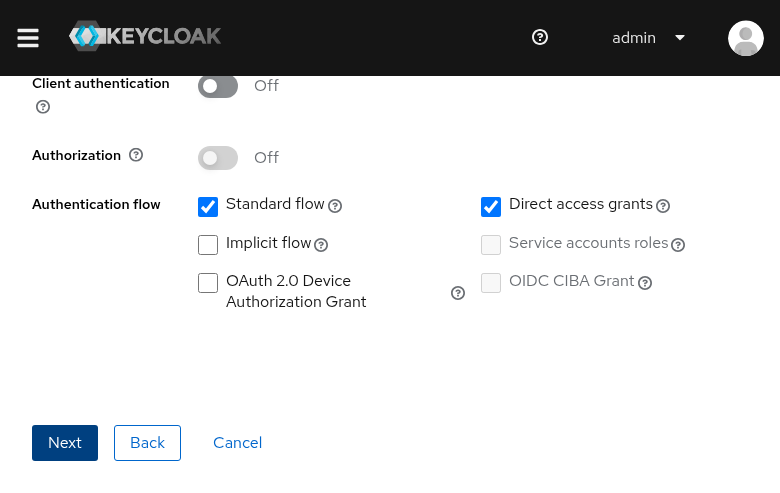

Click **Next**.

#### 3.4 Login Settings (Step 3)

Configure the redirect URIs and web origins:

| Field | Value | Description |
|-------|-------|-------------|
| Root URL | `https://pki.example.com` | Your frontend URL |
| Home URL | `https://pki.example.com` | Landing page after logout |
| Valid redirect URIs | `https://pki.example.com/*` | Allowed redirect destinations |
| Valid post logout redirect URIs | `https://pki.example.com/*` | Allowed post-logout destinations |
| Web origins | `https://pki.example.com` | CORS allowed origins |

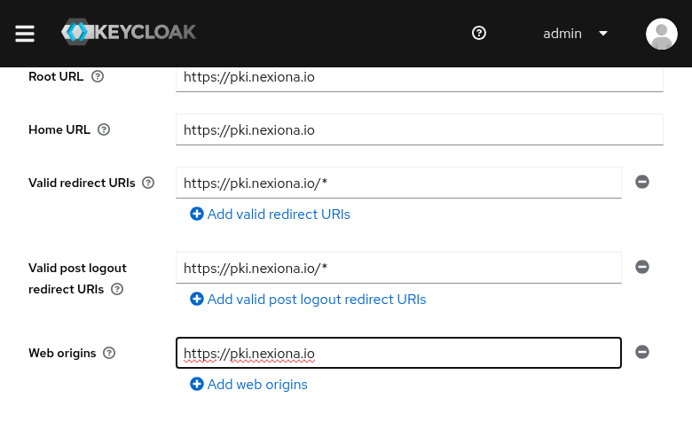

Click **Save**.

#### 3.5 Client Created

The client is now created and enabled.

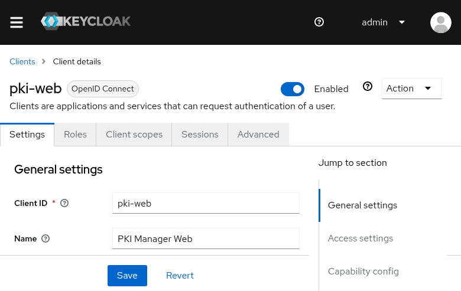

### Step 4: Create a Test User

Create a user to test the authentication flow.

#### 4.1 Navigate to Users

1. In the sidebar, click **Users**
2. Click **Create new user**

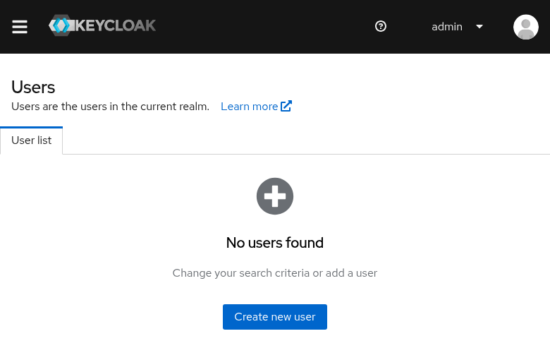

#### 4.2 Fill User Details

| Field | Value |
|-------|-------|
| Username | `testuser` |
| Email | `testuser@example.com` |
| First name | Test |
| Last name | User |

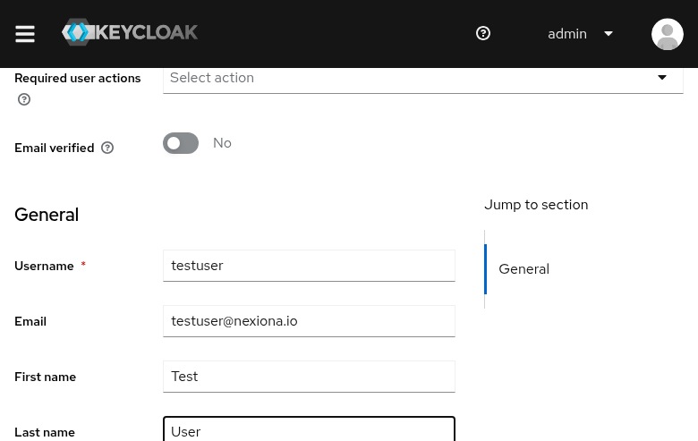

Click **Create**.

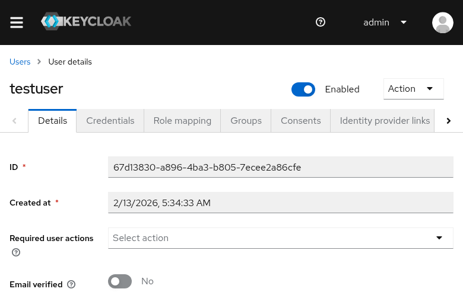

#### 4.3 Set Password

1. Go to the **Credentials** tab
2. Click **Set password**

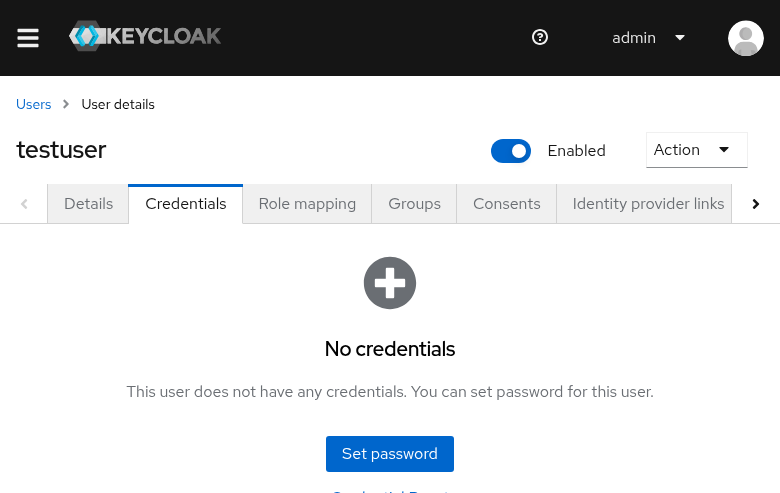

3. Enter password and confirmation
4. Set **Temporary** to **Off** (user won't be forced to change password)
5. Click **Save**

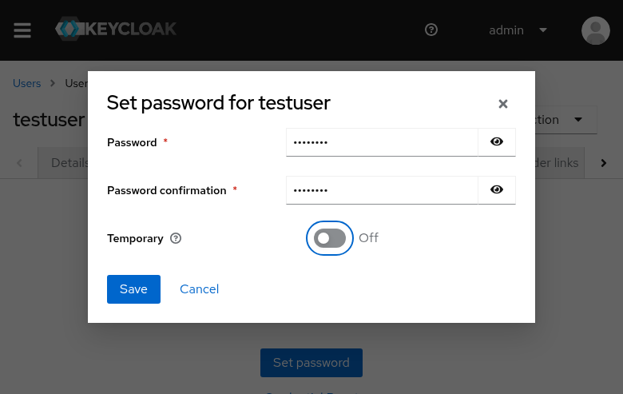

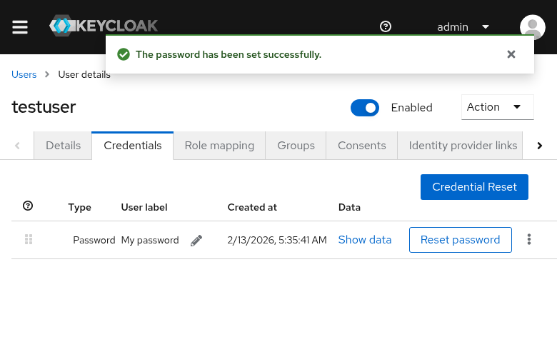

### Step 5: (Optional) Create M2M Client (pki-service)

For machine-to-machine authentication (API access without user interaction):

1. Create a new client with:
   - Client ID: `pki-service`
   - Client authentication: **On** (confidential client)
   - Service accounts roles: **Enabled**
   - All other flows: **Disabled**

2. After creation, go to **Credentials** tab to get the client secret

3. Add to backend `OIDC_AUDIENCE`: `pki-web,pki-service`

## PKI Manager Configuration

### Backend Configuration

Add these environment variables to your backend `.env` file:

```bash
# OIDC Authentication
OIDC_ISSUER=https://your-keycloak-domain/realms/pki-manager
OIDC_AUDIENCE=pki-web,pki-service
OIDC_ROLES_CLAIM=realm_access.roles
```

| Variable | Description |
|----------|-------------|
| `OIDC_ISSUER` | Keycloak realm URL (must match `iss` claim in tokens) |
| `OIDC_AUDIENCE` | Expected `aud` claim(s), comma-separated |
| `OIDC_ROLES_CLAIM` | JSON path to roles in the JWT token |

### Frontend Configuration

#### Option A: Build-time Configuration

Add to frontend `.env` before building:

```bash
VITE_OIDC_AUTHORITY=https://your-keycloak-domain/realms/pki-manager
VITE_OIDC_CLIENT_ID=pki-web
VITE_OIDC_SCOPE=openid profile email
```

#### Option B: Runtime Configuration (Docker)

Mount a `config.json` file:

```json
{
  "apiUrl": "https://api.pki.example.com/trpc",
  "oidc": {
    "authority": "https://your-keycloak-domain/realms/pki-manager",
    "clientId": "pki-web",
    "scope": "openid profile email"
  }
}
```

Add volume mount in `docker-compose.yml`:

```yaml
services:
  frontend:
    volumes:
      - ./config.json:/usr/share/nginx/html/config.json:ro
```

### Docker Configuration

Example `.env` for Docker deployment:

```bash
# Backend OIDC
OIDC_ISSUER=https://your-keycloak-domain/realms/pki-manager
OIDC_AUDIENCE=pki-web,pki-service
OIDC_ROLES_CLAIM=realm_access.roles

# Frontend (if not using runtime config.json)
VITE_OIDC_AUTHORITY=https://your-keycloak-domain/realms/pki-manager
VITE_OIDC_CLIENT_ID=pki-web
```

## Testing the Integration

1. **Access PKI Manager**: Navigate to `https://pki.example.com`

2. **Login Redirect**: You should be redirected to Keycloak login page

3. **Authenticate**: Enter test user credentials

4. **Callback**: After successful login, you're redirected back to PKI Manager

5. **Verify Token**: Check browser DevTools → Network → look for `Authorization: Bearer` header in API calls

## Troubleshooting

### "Invalid redirect URI" Error

**Cause**: The redirect URI doesn't match Keycloak's allowed list.

**Solution**:
- Verify `Valid redirect URIs` in Keycloak client settings
- Ensure the frontend URL exactly matches (including protocol and trailing slashes)

### "Invalid token issuer" Error

**Cause**: `OIDC_ISSUER` doesn't match the `iss` claim in the token.

**Solution**:
- Check the exact Keycloak realm URL
- Ensure no trailing slash mismatch
- Format: `https://keycloak-domain/realms/realm-name`

### "CORS blocked" Error

**Cause**: Keycloak or backend not allowing the frontend origin.

**Solution**:
- Add frontend URL to Keycloak client's `Web origins`
- Verify backend `FRONTEND_URL` environment variable

### "Token expired" or Silent Renewal Fails

**Cause**: Refresh token expired or silent renewal iframe blocked.

**Solution**:
- Check Keycloak realm's token lifespan settings
- Ensure `silent-renew.html` is accessible
- Verify third-party cookies aren't blocked

### User Gets "Access Denied" After Login

**Cause**: Token audience doesn't include the expected client ID.

**Solution**:
- Verify `OIDC_AUDIENCE` includes `pki-web`
- Check Keycloak client's audience mapper if customized

## Quick Reference

### Keycloak URLs

| Endpoint | URL Pattern |
|----------|-------------|
| Admin Console | `https://keycloak-domain/admin` |
| Realm Settings | `https://keycloak-domain/admin/master/console/#/realm-name` |
| OIDC Discovery | `https://keycloak-domain/realms/realm-name/.well-known/openid-configuration` |
| Token Endpoint | `https://keycloak-domain/realms/realm-name/protocol/openid-connect/token` |
| UserInfo Endpoint | `https://keycloak-domain/realms/realm-name/protocol/openid-connect/userinfo` |

### PKI Manager Environment Variables

| Variable | Example | Required |
|----------|---------|----------|
| `OIDC_ISSUER` | `https://keycloak.example.com/realms/pki` | Yes (backend) |
| `OIDC_AUDIENCE` | `pki-web,pki-service` | Yes (backend) |
| `OIDC_ROLES_CLAIM` | `realm_access.roles` | No (default shown) |
| `VITE_OIDC_AUTHORITY` | `https://keycloak.example.com/realms/pki` | Yes (frontend) |
| `VITE_OIDC_CLIENT_ID` | `pki-web` | Yes (frontend) |
| `VITE_OIDC_SCOPE` | `openid profile email` | No (default shown) |

## E2E Testing Configuration

PKI Manager includes a pre-configured Keycloak realm for E2E testing with RBAC verification.

### E2E Test Users

The E2E environment (`docker-compose.e2e.yml`) includes pre-configured test users:

| Username | Password | Roles | Use Case |
|----------|----------|-------|----------|
| `testadmin` | `Test123!` | `admin` | Admin operations: create/revoke/delete CAs and certificates |
| `testuser` | `Test123!` | `user` | Regular user: view and issue certificates only |

### E2E Keycloak Realm

The `pki-e2e` realm is automatically imported when starting the E2E Docker environment:

- **Realm**: `pki-e2e`
- **Client**: `pki-web` (public client with PKCE)
- **Roles**: `admin`, `user`
- **Direct Access Grants**: Enabled (for automated testing)
- **Brute Force Protection**: Disabled (to prevent test lockouts)

### Docker OIDC Networking

The E2E environment handles OIDC token validation in Docker with special configuration:

```yaml
# Keycloak (v26+) - use full URL for consistent issuer
environment:
  - KC_HOSTNAME=http://localhost:8180

# Backend - separate discovery URL for Docker networking
environment:
  - OIDC_ISSUER=http://localhost:8180/realms/pki-e2e
  - OIDC_DISCOVERY_BASE_URL=http://keycloak:8080/realms/pki-e2e
```

**Why this is needed:**
1. Browser accesses Keycloak at `localhost:8180` and tokens have `iss: http://localhost:8180/...`
2. Backend container cannot reach `localhost:8180` (it refers to the container itself)
3. `OIDC_DISCOVERY_BASE_URL` tells the backend to fetch OIDC config from Docker network (`keycloak:8080`)
4. The backend validates tokens against `OIDC_ISSUER` (what's in tokens) while fetching from the discovery URL

### Running E2E Tests

```bash
# Start the E2E environment
docker compose -f docker/docker-compose.e2e.yml up -d

# Wait for Keycloak to be ready (~60 seconds)
docker compose -f docker/docker-compose.e2e.yml ps

# Run RBAC tests
pnpm playwright test tests/e2e-rbac.spec.ts --reporter=list

# Cleanup
docker compose -f docker/docker-compose.e2e.yml down -v
```

### E2E Keycloak Access

| Service | URL | Credentials |
|---------|-----|-------------|
| Keycloak Console | http://localhost:8180 | admin / admin |
| OIDC Discovery | http://localhost:8180/realms/pki-e2e/.well-known/openid-configuration | - |

### Production Test Users

For production testing, create equivalent users in your production Keycloak:

1. **Create `testadmin` user**:
   - Username: `testadmin`
   - Password: `Test123!` (or stronger)
   - Realm roles: `admin`

2. **Create `testuser` user**:
   - Username: `testuser`
   - Password: `Test123!` (or stronger)
   - Realm roles: `user` (no `admin` role)

Then run production tests:

```bash
E2E_TARGET=production pnpm playwright test tests/e2e-rbac.spec.ts
```

## See Also

- [OIDC.md](OIDC.md) - How OIDC authentication works in PKI Manager (public clients, PKCE, token validation)
- [DEPLOYMENT.md](DEPLOYMENT.md) - Docker deployment and E2E testing instructions
- [Keycloak Documentation](https://www.keycloak.org/documentation)
- [OIDC Specification](https://openid.net/specs/openid-connect-core-1_0.html)
