# PKI Manager

> A modern, web-based Public Key Infrastructure management application for securely generating, issuing, managing, and revoking X.509 digital certificates.

[](LICENSE)
[](https://nodejs.org/)
[](https://pnpm.io/)

## Overview

PKI Manager provides complete control over your Private Key Infrastructure without relying on external certificate authorities. Perfect for enterprises, home labs, and development environments that demand full control over their security infrastructure.

### Key Highlights

- **Self-Hosted PKI**: Create and manage your own root Certificate Authorities
- **Multi-Type Certificates**: Server (TLS/SSL), Client Auth, S/MIME Email, Code Signing
- **Secure Key Management**: Integration with Cosmian KMS — private keys never touch disk
- **Kubernetes-Native**: cert-manager external issuer that auto-signs & auto-approves cluster CSRs (one cluster token = one CA)
- **CRL Revocation**: CA-signed Certificate Revocation Lists served over HTTP, with CRL Distribution Points (CDP) embedded in issued certificates
- **SSH Certificate Authority**: Dual User+Host CA with principals, KRL revocation, and per-host user access blocks pushed to a host agent
- **Dual API**: Typed tRPC for the SPA *plus* a REST/OpenAPI surface with live Swagger docs (`/api/v1`, `/api/docs`)
- **Bulk Operations**: CSV-based bulk certificate creation and batch operations
- **OIDC Authentication**: Provider-agnostic auth supporting Keycloak, Auth0, Okta, Azure AD
- **Modern UI**: React 19 with light/dark theme support and responsive design

## Screenshots

### Dashboard

Monitor your PKI at a glance with real-time statistics and expiration tracking.

<table>
  <tr>
    <td width="50%">
      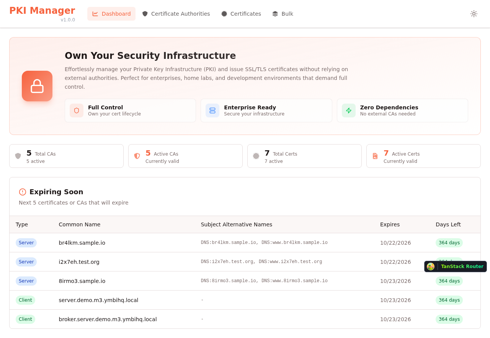
      <p align="center"><em>Dashboard - Light Mode</em></p>
    </td>
    <td width="50%">
      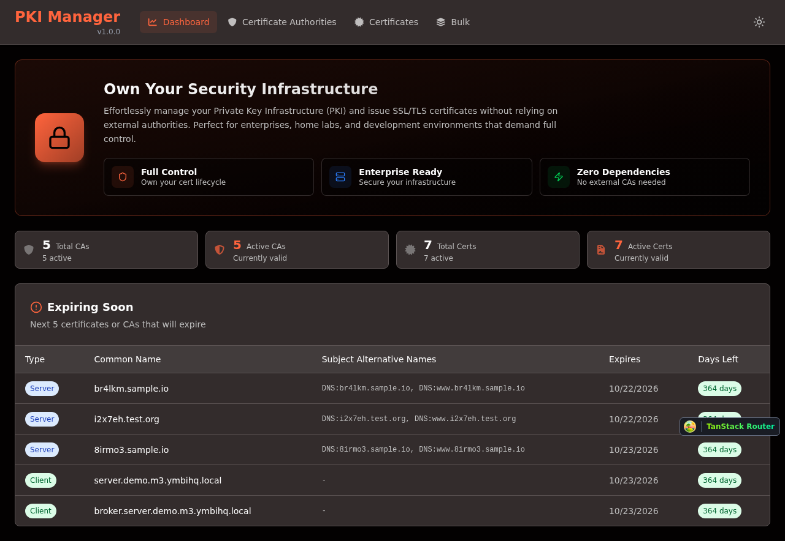
      <p align="center"><em>Dashboard - Dark Mode</em></p>
    </td>
  </tr>
</table>

### Certificate Authority Management

Create and manage self-signed root CAs with flexible configuration options.

<table>
  <tr>
    <td width="50%">
      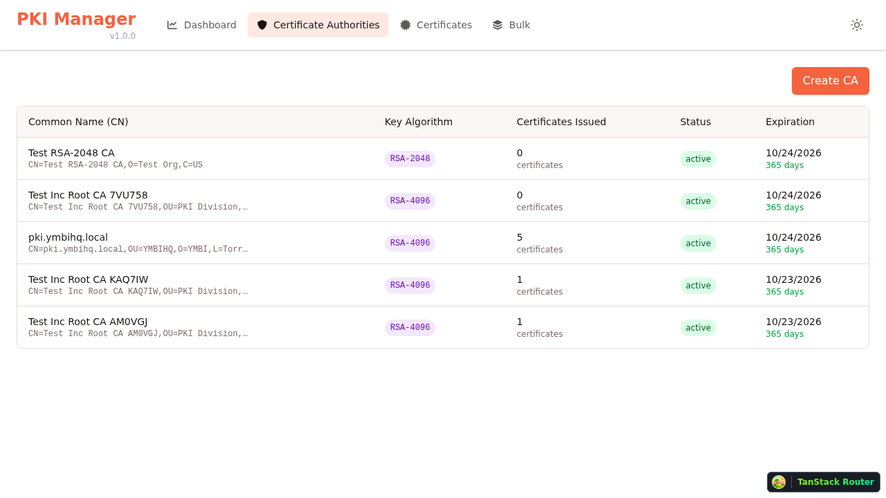
      <p align="center"><em>Certificate Authorities List</em></p>
    </td>
    <td width="50%">
      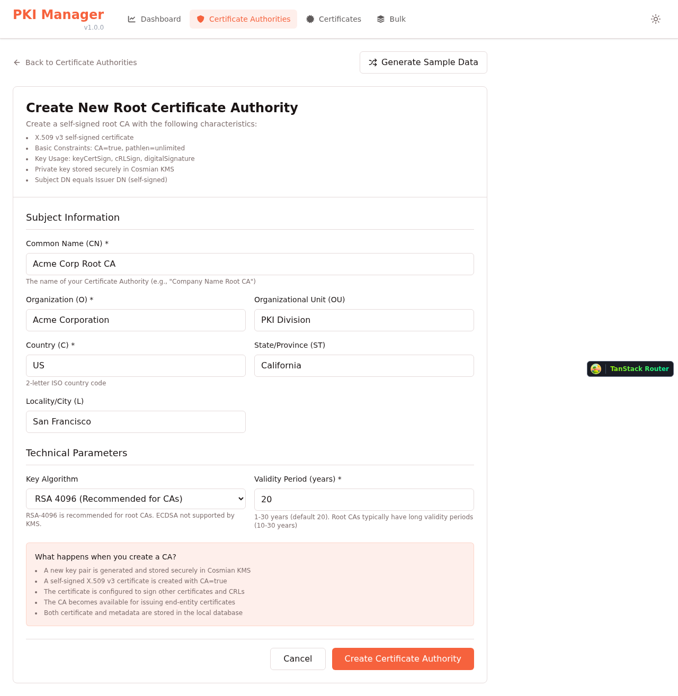
      <p align="center"><em>Create New CA</em></p>
    </td>
  </tr>
  <tr>
    <td width="50%">
      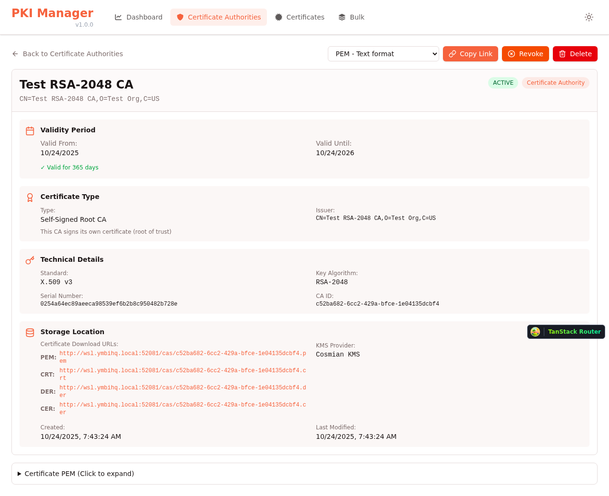
      <p align="center"><em>CA Details View</em></p>
    </td>
    <td width="50%">
      
      <p align="center"><em>Sample Data Generation</em></p>
    </td>
  </tr>
</table>

### Certificate Management

Issue, manage, and revoke certificates with comprehensive control.

<table>
  <tr>
    <td width="50%">
      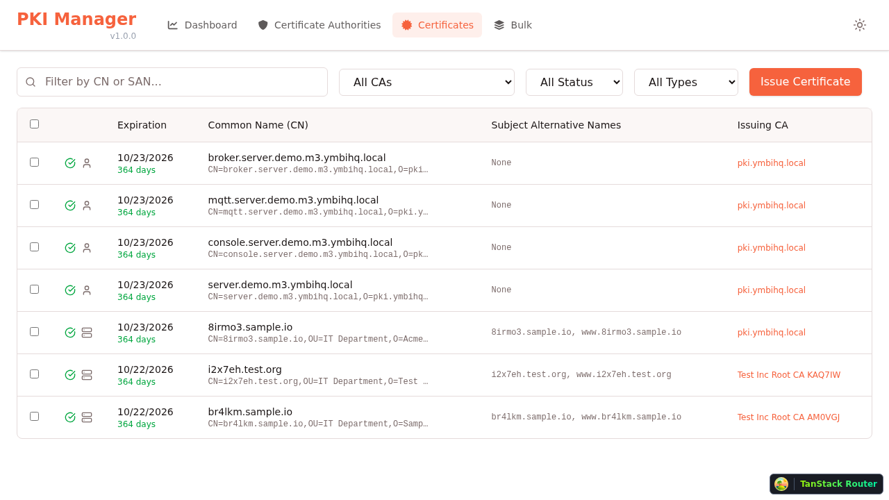
      <p align="center"><em>Certificates List with Filters</em></p>
    </td>
    <td width="50%">
      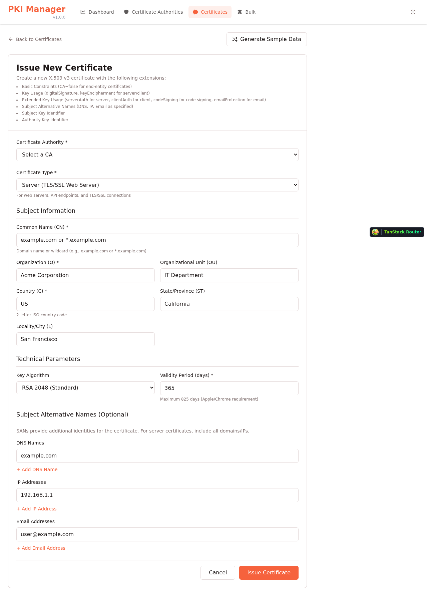
      <p align="center"><em>Issue New Certificate</em></p>
    </td>
  </tr>
  <tr>
    <td width="50%">
      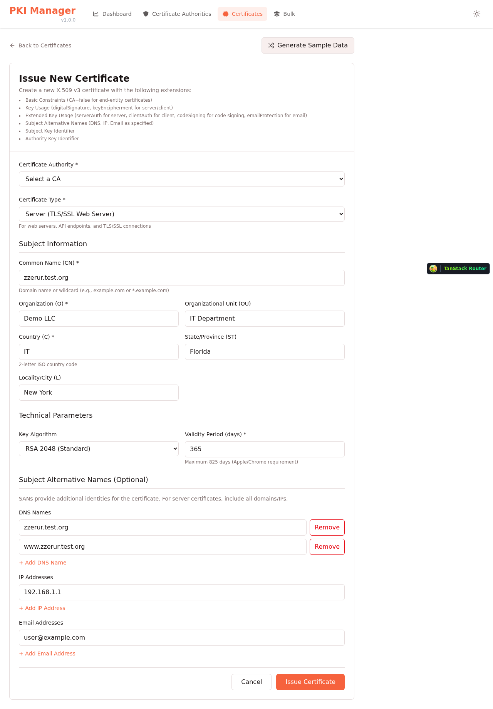
      <p align="center"><em>Subject Alternative Names (SANs)</em></p>
    </td>
    <td width="50%">
      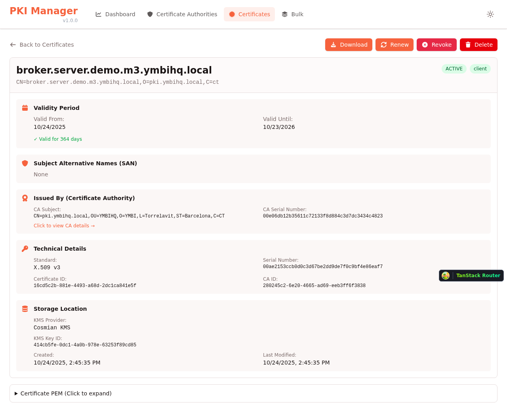
      <p align="center"><em>Certificate Details & Export</em></p>
    </td>
  </tr>
</table>

### Bulk Operations

Efficient batch certificate creation and management.

<table>
  <tr>
    <td width="50%">
      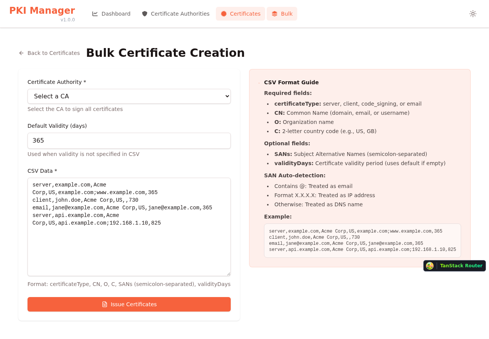
      <p align="center"><em>Bulk Certificate Creation (CSV)</em></p>
    </td>
    <td width="50%">
      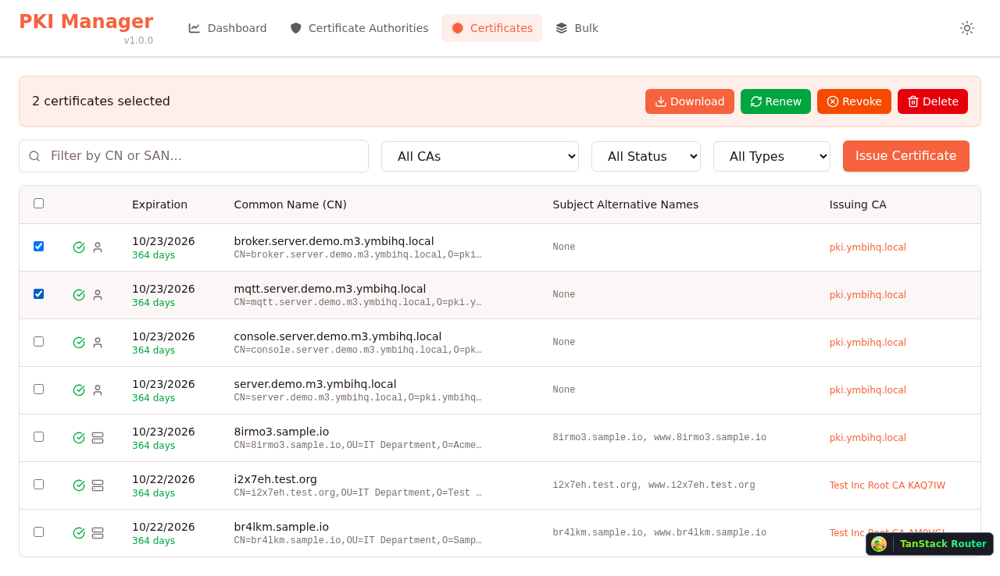
      <p align="center"><em>Bulk Operations (Download, Renew, Revoke)</em></p>
    </td>
  </tr>
</table>

## Features

### Certificate Authority Management
- ✅ Create self-signed root Certificate Authorities
- ✅ Configurable subject fields (CN, O, OU, C, ST, L)
- ✅ Key algorithm selection (RSA-2048, RSA-4096)
- ✅ Flexible validity periods (1-30 years)
- ✅ CA revocation with reason tracking
- ✅ Export in multiple formats (PEM, CRT, DER, CER)

### Certificate Issuance & Management
- ✅ **Server Certificates** - HTTPS/TLS for web servers and APIs
- ✅ **Client Certificates** - Client authentication and mTLS
- ✅ **Email (S/MIME)** - Email encryption and signing
- ✅ **Code Signing** - Software and code signing
- ✅ Subject Alternative Names (DNS, IP Address, Email)
- ✅ Advanced key algorithms (RSA-2048/4096, ECDSA-P256/P384)
- ✅ Certificate renewal with same parameters
- ✅ Revocation with standard reasons (keyCompromise, superseded, etc.)
- ✅ Comprehensive certificate details view

### Certificate Revocation (CRL)
- ✅ CA-signed Certificate Revocation Lists (RFC 5280)
- ✅ Served over HTTP for public distribution (no auth required)
- ✅ CRL Distribution Point (CDP) URL embedded in every issued certificate
- ✅ Automatic CRL regeneration on each revoke
- ✅ Standard revocation reasons (keyCompromise, superseded, cessationOfOperation, …)

### Export & Download
- ✅ Multiple formats: PEM, CRT, DER, CER
- ✅ Certificate chains (PEM Chain)
- ✅ PKCS#7 (P7B)
- ✅ PKCS#12 with private key (PFX, P12) - password protected
- ✅ Java KeyStore (JKS)
- ✅ Batch download (all formats as ZIP)
- ✅ Security warnings for private key exports

### Bulk Operations
- ✅ CSV-based bulk certificate creation
- ✅ Flexible field mapping with optional parameters
- ✅ SAN auto-detection (email, IP, DNS)
- ✅ Batch download multiple certificates
- ✅ Bulk renewal for expiring certificates
- ✅ Batch revocation with reason
- ✅ Multi-select deletion

### Kubernetes Integration (cert-manager)
- ✅ Native cert-manager **external issuer** (Go controller, Helm chart)
- ✅ Signs cluster CSRs via KMS — private key never leaves the KMS
- ✅ **Auto-approves** CertificateRequests via a dedicated approver RBAC role
- ✅ Scoped cluster tokens — **one cluster token = one CA**
- ✅ Revoke-on-delete, Prometheus metrics, in-cluster deploy via ingress-nginx
- ✅ Clusters management page to mint and manage cluster tokens

### Monitoring & Alerts
- ✅ Real-time dashboard with PKI statistics
- ✅ Expiration tracking with visual indicators
- ✅ "Expiring Soon" widget (configurable threshold)
- ✅ Color-coded status badges (active, revoked, expired)
- ✅ Automatic status updates based on validity periods

### Search & Filtering
- ✅ Search by Common Name or SAN
- ✅ Filter by issuing CA (with persistence)
- ✅ Filter by status (active/revoked/expired)
- ✅ Filter by certificate type
- ✅ Sortable tables with instant results

### Security
- ✅ Cosmian KMS integration for secure key storage
- ✅ Private keys never stored unencrypted locally
- ✅ Password-protected private key exports
- ✅ Audit logging for all operations
- ✅ Revocation tracking with detailed reasons
- ✅ Secure key pair generation (RSA, ECDSA)

### Authentication
- ✅ OpenID Connect (OIDC) authentication
- ✅ Provider-agnostic (Keycloak, Auth0, Okta, Azure AD)
- ✅ Authorization Code Flow with PKCE
- ✅ Role-based access control (admin/user roles)
- ✅ JWT validation via JWKS
- ✅ Silent token renewal

### API & Integrations
- ✅ Typed **tRPC** API powering the React SPA (end-to-end TypeScript inference)
- ✅ Full **REST / OpenAPI** surface at `/api/v1` (CAs, certificates, bulk, dashboard, search, reports, audit)
- ✅ Live **Swagger UI** at `/api/docs` + machine-readable spec at `/api/v1/openapi`
- ✅ External issuer API for Kubernetes clusters (`/api/v1/external`)
- ✅ First-party [Python CLI](https://github.com/oriolrius/pki-manager-cli) and [Ansible Collection](https://galaxy.ansible.com/ui/repo/published/oriolrius/pki_manager/)

### User Experience
- ✅ Modern, responsive UI with card-based layout
- ✅ Light/Dark theme with system detection
- ✅ Sample data generators for quick testing
- ✅ Form validation with helpful error messages
- ✅ Contextual action buttons
- ✅ Real-time status updates

### SSH Certificate Manager
A self-contained OpenSSH certificate authority lives under **`/ssh`**: a dual
(User + Host) CA with copy-paste onboarding, per-host deploy bundles, and a
guided checklist.

- ✅ Dual **User + Host** OpenSSH CA
- ✅ User-cert issuance with principals; long-lived TTL presets (+1m … +10y)
- ✅ Host registration + per-host deploy bundle
- ✅ Two-tier **KRL** revocation (global + per-host)
- ✅ **Per-host user access blocks** — block/unblock a user on specific hosts, incl. fleet-wide
- ✅ Zero-window, flag-gated issuance gate for immediate lockout
- ✅ `krl-client` host agent: pulls ECIES-encrypted, CA-signed per-host KRLs with anti-rollback + atomic install

**New to it? Start here:**
- [How it works (concept)](docs/ssh/concept.md) — the dual CA, two trust
  directions, the principal-in-two-places rule, two-tier revocation.
- [Operator quickstart](docs/ssh/operator-quickstart.md) — zero to first login.
- [Host & client setup](docs/ssh/setup.md) — set up an SSH server and client.
- [Automation API contract](docs/ssh-api-contract.md) · [Ansible role](ansible/README.md)

## Architecture

This is a **monorepo** project with two main packages:

```
pki-manager/
├── backend/          # Node.js/Fastify API server
├── frontend/         # React 19 SPA
├── assets/           # Screenshots and images
└── tests/            # E2E screenshot tests
```

## Technology Stack

### Backend
- **Framework**: Fastify 5.2 (high-performance HTTP server)
- **API Layer**: tRPC v11 (end-to-end type safety)
- **Database**: SQLite with better-sqlite3 (embedded, portable)
- **ORM**: Drizzle ORM 0.36 (type-safe SQL)
- **Validation**: Zod 3.24 (schema validation)
- **KMS**: Cosmian KMS (secure key management)
- **Testing**: Vitest 2.1
- **Runtime**: Node.js 20+

### Frontend
- **Framework**: React 19.2
- **Routing**: TanStack Router 1.133 (file-based, type-safe)
- **State Management**: TanStack Query 5.90 (server state)
- **API Client**: tRPC 11.0 (type-safe RPC)
- **Styling**: Tailwind CSS 4.1 (utility-first)
- **UI Components**: shadcn/ui (Radix UI primitives)
- **Icons**: Lucide React, FontAwesome
- **Build Tool**: Vite 7.1

### Testing
- **E2E**: Playwright 1.56 (screenshot automation)

## Quick Start

```bash
# 1. Start Cosmian KMS
cd kms && docker compose up -d

# 2. Start Keycloak (for authentication)
cd keycloak && docker compose up -d

# 3. Install dependencies
pnpm install

# 4. Configure and run
cp backend/.env.example backend/.env
cp frontend/.env.example frontend/.env
cd backend && pnpm db:migrate
pnpm dev  # from root
```

- **Frontend**: http://localhost:5173
- **Backend API**: http://localhost:3000
- **Cosmian KMS**: http://localhost:42998
- **Keycloak**: http://localhost:42997 (admin/admin)

**Test Users**: Login with `admin`/`admin` or `user`/`user`

For detailed setup, see [DEVELOPMENT.md](DEVELOPMENT.md) and [Authentication Guide](backlog/docs/doc-004%20-%20OIDC-Authentication-Setup-Guide.md).

## Common Use Cases

### Enterprise
- Internal CA hierarchy for corporate networks
- Employee certificates for VPN/Wi-Fi
- S/MIME email encryption
- Code signing for software distribution

### Development
- Local HTTPS certificates for development
- API authentication testing
- Microservices mTLS
- Container certificate management

### Home Lab
- Secure internal services (Proxmox, TrueNAS)
- Home automation HTTPS
- Private VPN server certificates
- IoT device authentication

## API Documentation

The application exposes **two APIs over the same service layer**:

- **tRPC** (`/trpc`) — end-to-end type-safe, used by the React SPA.
- **REST / OpenAPI** (`/api/v1`) — language-agnostic, with an interactive
  **Swagger UI at `/api/docs`** and the raw spec at `/api/v1/openapi`. This is
  what the [Python CLI](https://github.com/oriolrius/pki-manager-cli) and
  [Ansible Collection](https://galaxy.ansible.com/ui/repo/published/oriolrius/pki_manager/) consume.
- A scoped **external issuer API** (`/api/v1/external`) serves Kubernetes
  clusters (CSR signing, revocation) and the SSH host agents.

Key tRPC procedures (each has a REST twin under `/api/v1`):

### Dashboard
- `dashboard.stats` - Get PKI statistics
- `dashboard.expiringSoon` - Get expiring CAs/certificates

### Certificate Authorities
- `ca.list` - List all CAs
- `ca.getById` - Get CA details
- `ca.create` - Create new CA
- `ca.revoke` - Revoke CA
- `ca.delete` - Delete CA
- `ca.download` - Download CA certificate

### Certificates
- `certificate.list` - List certificates (with filters)
- `certificate.getById` - Get certificate details
- `certificate.issue` - Issue new certificate
- `certificate.bulkIssue` - Bulk certificate creation
- `certificate.renew` - Renew certificate
- `certificate.revoke` - Revoke certificate
- `certificate.delete` - Delete certificate
- `certificate.download` - Download certificate

tRPC procedures are fully type-safe with automatic TypeScript inference; the
same operations are available as REST endpoints documented in Swagger.

## Security Considerations

- Private keys are stored securely in Cosmian KMS
- Password-protect all private key exports
- Regularly monitor certificate expiration
- Use strong key algorithms (RSA-4096 or ECDSA-P384 for sensitive use cases)
- Revoke compromised certificates immediately
- Backup your database regularly
- Secure access to the KMS endpoint
- Use HTTPS in production

## Contributing

Contributions are welcome! Please feel free to submit a Pull Request.

## License

This project is licensed under the Apache License 2.0 - see the [LICENSE](LICENSE) file for details.

## Related Projects

| Project | Description |
|---------|-------------|
| [pki-manager-cli](https://github.com/oriolrius/pki-manager-cli) | Python CLI tool for PKI Manager - manage certificates from the command line |
| [pki-manager-skill](https://github.com/oriolrius/pki-manager-skill) | Claude Code skill for AI-assisted certificate management |
| [pki-manager-ansible](https://github.com/oriolrius/pki-manager-ansible) | Ansible Collection for certificate management ([Galaxy](https://galaxy.ansible.com/ui/repo/published/oriolrius/pki_manager/)) |
| [ssh-ca-cosmian-kms](https://github.com/oriolrius/ssh-ca-cosmian-kms) | Design reference and Docker PoC for the OpenSSH Certificate Authority behind this project: KMS-held CA keys signed via PKCS#11 (the key never touches disk), host/user certs, RBAC principals, and KMS-backed KRL distribution |
| [ssh-per-host-access-blocks-lab](https://github.com/oriolrius/ssh-per-host-access-blocks-lab) | Reproducible Docker lab for the per-host user access-block model used here: Host-CA-signed, ECIES-encrypted per-host KRLs pulled by `krl-client`, with anti-rollback and unblock-without-reissue |

## Additional Resources

- [Development Guide](DEVELOPMENT.md) - Setup, scripts, and development workflow
- [Authentication Guide](backlog/docs/doc-004%20-%20OIDC-Authentication-Setup-Guide.md) - OIDC setup and provider configuration
- [Keycloak Setup](keycloak/README.md) - Local Keycloak development environment
- [Cosmian KMS Documentation](https://docs.cosmian.com/)
- [X.509 Certificate Standard (RFC 5280)](https://datatracker.ietf.org/doc/html/rfc5280)
- [PKCS Standards](https://en.wikipedia.org/wiki/PKCS)

---

**Built with ❤️ using modern web technologies**
