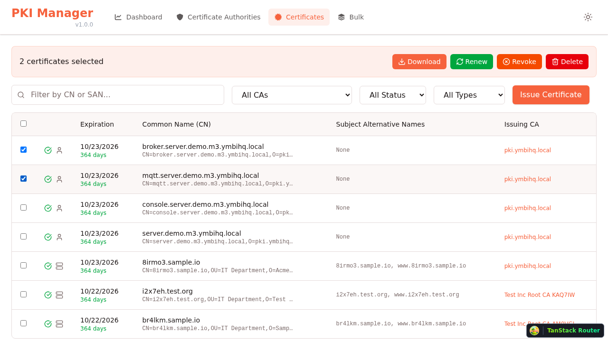

# PKI Manager

> A modern, web-based Public Key Infrastructure management application for securely generating, issuing, managing, and revoking X.509 digital certificates.

[](LICENSE)
[](https://nodejs.org/)
[](https://pnpm.io/)

## Overview

PKI Manager provides complete control over your Private Key Infrastructure without relying on external certificate authorities. Perfect for enterprises, home labs, and development environments that demand full control over their security infrastructure.

### Key Highlights

- **Self-Hosted PKI**: Create and manage your own root Certificate Authorities
- **Multi-Type Certificates**: Server (TLS/SSL), Client Auth, S/MIME Email, Code Signing
- **Secure Key Management**: Integration with Cosmian KMS for secure key storage
- **Bulk Operations**: CSV-based bulk certificate creation and batch operations
- **Modern UI**: React 19 with light/dark theme support and responsive design
- **Type-Safe**: End-to-end TypeScript with tRPC for API type safety

## Screenshots

### Dashboard

Monitor your PKI at a glance with real-time statistics and expiration tracking.

<table>
  <tr>
    <td width="50%">
      
      <p align="center"><em>Dashboard - Light Mode</em></p>
    </td>
    <td width="50%">
      
      <p align="center"><em>Dashboard - Dark Mode</em></p>
    </td>
  </tr>
</table>

### Certificate Authority Management

Create and manage self-signed root CAs with flexible configuration options.

<table>
  <tr>
    <td width="50%">
      
      <p align="center"><em>Certificate Authorities List</em></p>
    </td>
    <td width="50%">
      
      <p align="center"><em>Create New CA</em></p>
    </td>
  </tr>
  <tr>
    <td width="50%">
      
      <p align="center"><em>CA Details View</em></p>
    </td>
    <td width="50%">
      
      <p align="center"><em>Sample Data Generation</em></p>
    </td>
  </tr>
</table>

### Certificate Management

Issue, manage, and revoke certificates with comprehensive control.

<table>
  <tr>
    <td width="50%">
      
      <p align="center"><em>Certificates List with Filters</em></p>
    </td>
    <td width="50%">
      
      <p align="center"><em>Issue New Certificate</em></p>
    </td>
  </tr>
  <tr>
    <td width="50%">
      
      <p align="center"><em>Subject Alternative Names (SANs)</em></p>
    </td>
    <td width="50%">
      
      <p align="center"><em>Certificate Details & Export</em></p>
    </td>
  </tr>
</table>

### Bulk Operations

Efficient batch certificate creation and management.

<table>
  <tr>
    <td width="50%">
      
      <p align="center"><em>Bulk Certificate Creation (CSV)</em></p>
    </td>
    <td width="50%">
      
      <p align="center"><em>Bulk Operations (Download, Renew, Revoke)</em></p>
    </td>
  </tr>
</table>

## Features

### Certificate Authority Management
- ✅ Create self-signed root Certificate Authorities
- ✅ Configurable subject fields (CN, O, OU, C, ST, L)
- ✅ Key algorithm selection (RSA-2048, RSA-4096)
- ✅ Flexible validity periods (1-30 years)
- ✅ CA revocation with reason tracking
- ✅ Export in multiple formats (PEM, CRT, DER, CER)

### Certificate Issuance & Management
- ✅ **Server Certificates** - HTTPS/TLS for web servers and APIs
- ✅ **Client Certificates** - Client authentication and mTLS
- ✅ **Email (S/MIME)** - Email encryption and signing
- ✅ **Code Signing** - Software and code signing
- ✅ Subject Alternative Names (DNS, IP Address, Email)
- ✅ Advanced key algorithms (RSA-2048/4096, ECDSA-P256/P384)
- ✅ Certificate renewal with same parameters
- ✅ Revocation with standard reasons (keyCompromise, superseded, etc.)
- ✅ Comprehensive certificate details view

### Export & Download
- ✅ Multiple formats: PEM, CRT, DER, CER
- ✅ Certificate chains (PEM Chain)
- ✅ PKCS#7 (P7B)
- ✅ PKCS#12 with private key (PFX, P12) - password protected
- ✅ Java KeyStore (JKS)
- ✅ Batch download (all formats as ZIP)
- ✅ Security warnings for private key exports

### Bulk Operations
- ✅ CSV-based bulk certificate creation
- ✅ Flexible field mapping with optional parameters
- ✅ SAN auto-detection (email, IP, DNS)
- ✅ Batch download multiple certificates
- ✅ Bulk renewal for expiring certificates
- ✅ Batch revocation with reason
- ✅ Multi-select deletion

### Monitoring & Alerts
- ✅ Real-time dashboard with PKI statistics
- ✅ Expiration tracking with visual indicators
- ✅ "Expiring Soon" widget (configurable threshold)
- ✅ Color-coded status badges (active, revoked, expired)
- ✅ Automatic status updates based on validity periods

### Search & Filtering
- ✅ Search by Common Name or SAN
- ✅ Filter by issuing CA (with persistence)
- ✅ Filter by status (active/revoked/expired)
- ✅ Filter by certificate type
- ✅ Sortable tables with instant results

### Security
- ✅ Cosmian KMS integration for secure key storage
- ✅ Private keys never stored unencrypted locally
- ✅ Password-protected private key exports
- ✅ Audit logging for all operations
- ✅ Revocation tracking with detailed reasons
- ✅ Secure key pair generation (RSA, ECDSA)

### User Experience
- ✅ Modern, responsive UI with card-based layout
- ✅ Light/Dark theme with system detection
- ✅ Sample data generators for quick testing
- ✅ Form validation with helpful error messages
- ✅ Contextual action buttons
- ✅ Real-time status updates

## Architecture

This is a **monorepo** project with two main packages:

```
pki-manager/
├── backend/          # Node.js/Fastify API server
├── frontend/         # React 19 SPA
├── assets/           # Screenshots and images
└── tests/            # E2E screenshot tests
```

## Technology Stack

### Backend
- **Framework**: Fastify 5.2 (high-performance HTTP server)
- **API Layer**: tRPC v11 (end-to-end type safety)
- **Database**: SQLite with better-sqlite3 (embedded, portable)
- **ORM**: Drizzle ORM 0.36 (type-safe SQL)
- **Validation**: Zod 3.24 (schema validation)
- **KMS**: Cosmian KMS (secure key management)
- **Testing**: Vitest 2.1
- **Runtime**: Node.js 20+

### Frontend
- **Framework**: React 19.2
- **Routing**: TanStack Router 1.133 (file-based, type-safe)
- **State Management**: TanStack Query 5.90 (server state)
- **API Client**: tRPC 11.0 (type-safe RPC)
- **Styling**: Tailwind CSS 4.1 (utility-first)
- **UI Components**: shadcn/ui (Radix UI primitives)
- **Icons**: Lucide React, FontAwesome
- **Build Tool**: Vite 7.1

### Testing
- **E2E**: Playwright 1.56 (screenshot automation)

## Prerequisites

- Node.js >= 20.0.0
- pnpm >= 9.0.0
- Cosmian KMS instance (for secure key storage)

## Getting Started

### 1. Installation

```bash
# Install dependencies
pnpm install
```

### 2. Environment Configuration

```bash
# Copy backend environment template
cp backend/.env.example backend/.env

# Edit backend/.env with your configuration:
# - Database path
# - Cosmian KMS endpoint and authentication
# - Server port (default: 3000)
```

### 3. Database Setup

```bash
# Run migrations
cd backend
pnpm db:migrate
```

### 4. Start Development Servers

```bash
# Start both backend and frontend (from root)
pnpm dev
```

This will start:
- **Backend API** at http://localhost:3000
- **Frontend** at http://localhost:5173

### 5. Build for Production

```bash
# Build both packages
pnpm build

# Start production servers
cd backend && pnpm start    # Backend
cd frontend && pnpm preview # Frontend preview
```

## Available Scripts

### Root (Workspace)
```bash
pnpm dev              # Start both backend and frontend in dev mode
pnpm build            # Build both packages for production
pnpm test             # Run tests in all packages
pnpm typecheck        # Type check all packages
pnpm lint             # Lint all packages
pnpm clean            # Clean all build artifacts and node_modules
pnpm test:screenshots # Run Playwright screenshot tests
```

### Backend
```bash
pnpm dev              # Start dev server with hot reload
pnpm build            # Build for production
pnpm start            # Start production server
pnpm test             # Run Vitest tests
pnpm db:generate      # Generate Drizzle migrations
pnpm db:migrate       # Run database migrations
pnpm db:studio        # Open Drizzle Studio (DB GUI)
```

### Frontend
```bash
pnpm dev              # Start Vite dev server
pnpm build            # Build for production
pnpm preview          # Preview production build
pnpm lint             # Run ESLint
```

## Project Structure

```
pki-manager/
├── backend/
│   ├── src/
│   │   ├── server.ts               # Fastify server entry point
│   │   ├── trpc/
│   │   │   ├── router.ts           # Main tRPC router
│   │   │   ├── schemas.ts          # Zod validation schemas
│   │   │   └── procedures/         # API endpoints by domain
│   │   │       ├── ca.ts           # CA management
│   │   │       ├── certificate.ts  # Certificate operations
│   │   │       ├── dashboard.ts    # Dashboard stats
│   │   │       └── crl.ts          # CRL management
│   │   ├── db/
│   │   │   ├── schema.ts           # Drizzle ORM schema
│   │   │   ├── index.ts            # Database connection
│   │   │   └── migrations/         # SQL migrations
│   │   ├── kms/
│   │   │   └── client.ts           # Cosmian KMS client
│   │   └── crypto/                 # Certificate utilities
│   └── package.json
├── frontend/
│   ├── src/
│   │   ├── main.tsx                # App entry point
│   │   ├── routes/                 # TanStack Router routes
│   │   │   ├── __root.tsx          # Layout with navigation
│   │   │   ├── index.tsx           # Dashboard (/)
│   │   │   ├── cas.tsx             # CA list (/cas)
│   │   │   ├── cas.new.tsx         # Create CA (/cas/new)
│   │   │   ├── cas.$id.tsx         # CA details (/cas/:id)
│   │   │   ├── certificates.tsx    # Cert list (/certificates)
│   │   │   ├── certificates.new.tsx  # Issue cert (/certificates/new)
│   │   │   ├── certificates.$id.tsx  # Cert details (/certificates/:id)
│   │   │   └── certificates.bulk.tsx # Bulk creation (/certificates/bulk)
│   │   ├── components/             # React components
│   │   │   ├── theme-provider.tsx  # Theme context
│   │   │   └── theme-toggle.tsx    # Theme switcher
│   │   └── lib/
│   │       └── trpc.ts             # tRPC client setup
│   └── package.json
├── tests/
│   └── screenshots.spec.ts         # Playwright screenshot tests
├── assets/                          # Screenshots for documentation
├── playwright.config.ts             # Playwright configuration
├── FEATURES.md                      # Detailed feature documentation
└── package.json                     # Root workspace config
```

## Development Workflow

### Adding API Endpoints

1. **Define schema** in `backend/src/trpc/schemas.ts`:
```typescript
export const createCertificateSchema = z.object({
  caId: z.string().uuid(),
  subjectDn: z.string(),
  // ...
});
```

2. **Add procedure** in `backend/src/trpc/procedures/certificate.ts`:
```typescript
export const certificateProcedures = {
  create: protectedProcedure
    .input(createCertificateSchema)
    .mutation(async ({ input, ctx }) => {
      // Implementation
    }),
};
```

3. **Use in frontend**:
```typescript
const mutation = trpc.certificate.create.useMutation();
await mutation.mutateAsync({ caId, subjectDn, /* ... */ });
```

### Adding Frontend Routes

Create file in `frontend/src/routes/`:
- `filename.tsx` → `/filename`
- `filename.$id.tsx` → `/filename/:id`
- `filename.new.tsx` → `/filename/new`

### Database Changes

```bash
# 1. Edit backend/src/db/schema.ts
# 2. Generate migration
cd backend && pnpm db:generate

# 3. Apply migration
pnpm db:migrate
```

## Common Use Cases

### Enterprise
- Internal CA hierarchy for corporate networks
- Employee certificates for VPN/Wi-Fi
- S/MIME email encryption
- Code signing for software distribution

### Development
- Local HTTPS certificates for development
- API authentication testing
- Microservices mTLS
- Container certificate management

### Home Lab
- Secure internal services (Proxmox, TrueNAS)
- Home automation HTTPS
- Private VPN server certificates
- IoT device authentication

## API Documentation

The application uses tRPC for type-safe API communication. Key endpoints:

### Dashboard
- `dashboard.stats` - Get PKI statistics
- `dashboard.expiringSoon` - Get expiring CAs/certificates

### Certificate Authorities
- `ca.list` - List all CAs
- `ca.getById` - Get CA details
- `ca.create` - Create new CA
- `ca.revoke` - Revoke CA
- `ca.delete` - Delete CA
- `ca.download` - Download CA certificate

### Certificates
- `certificate.list` - List certificates (with filters)
- `certificate.getById` - Get certificate details
- `certificate.issue` - Issue new certificate
- `certificate.bulkIssue` - Bulk certificate creation
- `certificate.renew` - Renew certificate
- `certificate.revoke` - Revoke certificate
- `certificate.delete` - Delete certificate
- `certificate.download` - Download certificate

All endpoints are fully type-safe with automatic TypeScript inference.

## Testing

### Screenshot Tests

Automated screenshot testing with Playwright:

```bash
# Run all screenshot tests
pnpm test:screenshots

# Run with UI mode
pnpm test:screenshots:ui

# Run specific test
pnpm playwright test tests/screenshots.spec.ts -g "Dashboard"
```

Screenshots are saved to `assets/` directory.

## Troubleshooting

| Issue | Solution |
|-------|----------|
| **tRPC type errors** | Run `pnpm dev` in backend to regenerate types |
| **Frontend can't connect** | Check `VITE_API_URL` in frontend env |
| **Database locked** | Close Drizzle Studio (`pnpm db:studio`) |
| **Port in use** | Kill process: `lsof -ti:3000 \| xargs kill` |
| **KMS connection fails** | Verify Cosmian KMS endpoint and credentials in `.env` |
| **Certificate creation fails** | Check KMS permissions and CA validity |

## Security Considerations

- Private keys are stored securely in Cosmian KMS
- Password-protect all private key exports
- Regularly monitor certificate expiration
- Use strong key algorithms (RSA-4096 or ECDSA-P384 for sensitive use cases)
- Revoke compromised certificates immediately
- Backup your database regularly
- Secure access to the KMS endpoint
- Use HTTPS in production

## Contributing

Contributions are welcome! Please feel free to submit a Pull Request.

## License

This project is licensed under the Apache License 2.0 - see the [LICENSE](LICENSE) file for details.

## Additional Resources

- [Cosmian KMS Documentation](https://docs.cosmian.com/)
- [X.509 Certificate Standard (RFC 5280)](https://datatracker.ietf.org/doc/html/rfc5280)
- [PKCS Standards](https://en.wikipedia.org/wiki/PKCS)

---

**Built with ❤️ using modern web technologies**
